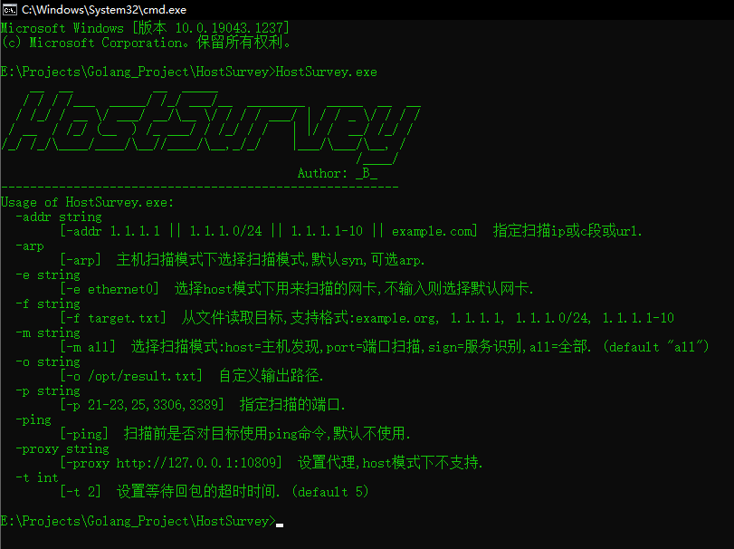
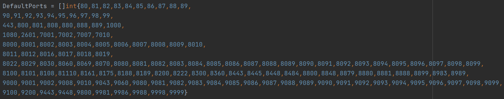
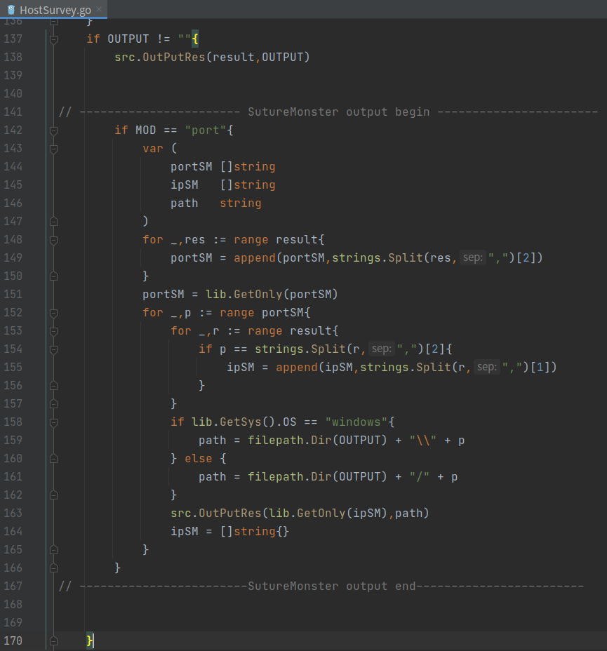

# HostSurvey
这是一款针对主机信息收集的小工具，整合并魔改了goscan-arp_scan、ServerScan_pro和dismap，
然后增加了syn扫描功能，重写了输出格式，分为host、port、sign三个模块。 
写这个工具的初衷是为了整合进SutureMonster这个项目，整合完功能模块后发现可以单独当做一个扫描器用，于是就有了HostSurvey。 

# Use-Agent
 
example： 
> HostSurvey -addr 192.168.75.1 -e eth0 
> HostSurvey -addr 192.168.75.1 -e eth0 -m host 
> HostSurvey -f target.txt -m port -p 21-23,25,80-89,3306,6379 

# 模块功能
HostSurvey包含了三种模块，分别是host、port、sign，通过参数 `-m` 指定，默认为all，即全选。 
### 1.host模块：
这个模块功能为主机发现，支持syn扫描以及arp扫描，默认向目标主机的80端口发syn包，可以通过可选参数 `-arp` 选择arp扫描，需要注意的是，arp不可跨路由，因此仅支持同网段下的主机发现。 
在运行host模块的时候，需要通过 `-e` 参数指定一个用来接收数据包的网卡名，这个网卡通常是正在使用且能够进行网络数据交互的网卡。 

### 2.port模块：
这个模块的代码大部分来源于一款开源的端口扫描器：ServerScan，扫描原理就是全连接扫描，在内网确实没什么担心的，但是放到外网就不太行了，因此在扫描之前先用syn探测主机是否存活，确认后再进行端口扫描，可以通过 `-p` 参数来指定扫描的端口，默认为以下端口： 
 

### 3.sign模块：
这个模块整合自dismap，输入域名对其发起请求，通过dismap的特征库匹配服务器的banner信息，在这些基础上添加了代理功能，使得sign模块在扫描的时候能够通过代理发送请求，提高了隐蔽性。

# 其它
为了整合到SutureMonster，在HostSurvey.go中有一段代码改了端口扫描的结果输出格式，只需要将那段代码注释或者直接去掉就可以正常使用了，位置如下： 
 

## 注意
1.使用这个工具的时候要以管理员权限运行； 
2.运行前要确保已经安装了pcap；
